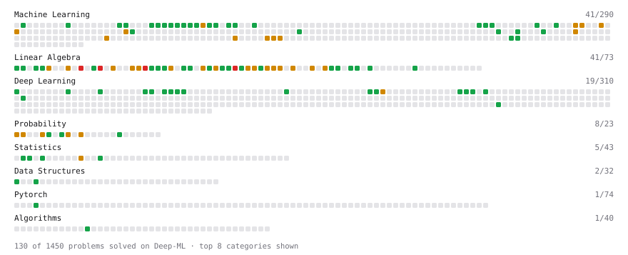

# Deep-ML

My machine learning practice from [Deep-ML](https://www.deep-ml.com). Every solution here was written by hand.

**Completed:** Calculus (9/9)

**160** solved · 116 problems · 0 labs · 44 math

[**Browse the interactive portfolio**](https://yassinzayed.github.io/deep-ml/) to replay this filling in over time.

## Problems

| | Difficulty | Solved | |
| --- | --- | --- | --- |
| [Binary Classification with Logistic Regression](https://www.deep-ml.com/problems/104) | easy | 2026-09-22 | [solution](problems/0104-binary-classification-with-logistic-regression) |
| [Calculate Conditional Probability from Data](https://www.deep-ml.com/problems/168) | easy | 2026-09-19 | [solution](problems/0168-calculate-conditional-probability-from-data) |
| [Calculate Cosine Similarity Between Vectors](https://www.deep-ml.com/problems/76) | easy | 2026-09-17 | [solution](problems/0076-calculate-cosine-similarity-between-vectors) |
| [Calculate Dice Score for Classification](https://www.deep-ml.com/problems/73) | easy | 2026-09-24 | [solution](problems/0073-calculate-dice-score-for-classification) |
| [Calculate F1 Score from Predicted and True Labels](https://www.deep-ml.com/problems/91) | easy | 2026-09-24 | [solution](problems/0091-calculate-f1-score-from-predicted-and-true-labels) |
| [Calculate Image Brightness](https://www.deep-ml.com/problems/70) | easy | 2026-09-24 | [solution](problems/0070-calculate-image-brightness) |
| [Calculate Jaccard Index for Binary Classification](https://www.deep-ml.com/problems/72) | easy | 2026-09-24 | [solution](problems/0072-calculate-jaccard-index-for-binary-classification) |
| [Calculate Mean Absolute Error (MAE)](https://www.deep-ml.com/problems/93) | easy | 2026-09-22 | [solution](problems/0093-calculate-mean-absolute-error-mae) |
| [Calculate Mean by Row or Column](https://www.deep-ml.com/problems/4) | easy | 2026-09-17 | [solution](problems/0004-calculate-mean-by-row-or-column) |
| [Calculate Number of Parameters in Neural Network](https://www.deep-ml.com/problems/371) | easy | 2026-09-24 | [solution](problems/0371-calculate-number-of-parameters-in-neural-network) |
| [Calculate R-squared for Regression Analysis](https://www.deep-ml.com/problems/69) | easy | 2026-09-22 | [solution](problems/0069-calculate-r-squared-for-regression-analysis) |
| [Calculate Root Mean Square Error (RMSE)](https://www.deep-ml.com/problems/71) | easy | 2026-09-22 | [solution](problems/0071-calculate-root-mean-square-error-rmse) |
| [Calculate SVM Margin Width](https://www.deep-ml.com/problems/282) | easy | 2026-09-24 | [solution](problems/0282-calculate-svm-margin-width) |
| [Check Linear Independence of Vectors](https://www.deep-ml.com/problems/331) | easy | 2026-09-20 | [solution](problems/0331-check-linear-independence-of-vectors) |
| [Compute Posterior Probability using Bayes' Theorem](https://www.deep-ml.com/problems/336) | easy | 2026-09-20 | [solution](problems/0336-compute-posterior-probability-using-bayes-theorem) |
| [Compute the Cross Product of Two 3D Vectors](https://www.deep-ml.com/problems/118) | easy | 2026-09-19 | [solution](problems/0118-compute-the-cross-product-of-two-3d-vectors) |
| [Demonstrate Law of Large Numbers with Sampling](https://www.deep-ml.com/problems/342) | easy | 2026-09-19 | [solution](problems/0342-demonstrate-law-of-large-numbers-with-sampling) |
| [Derivative of a Polynomial](https://www.deep-ml.com/problems/116) | easy | 2026-09-17 | [solution](problems/0116-derivative-of-a-polynomial) |
| [Derivatives of Activation Functions](https://www.deep-ml.com/problems/217) | easy | 2026-09-19 | [solution](problems/0217-derivatives-of-activation-functions) |
| [Descriptive Statistics Calculator](https://www.deep-ml.com/problems/78) | easy | 2026-09-17 | [solution](problems/0078-descriptive-statistics-calculator) |
| [Detect Overfitting or Underfitting](https://www.deep-ml.com/problems/86) | easy | 2026-09-22 | [solution](problems/0086-detect-overfitting-or-underfitting) |
| [Dot Product Calculator](https://www.deep-ml.com/problems/83) | easy | 2026-09-17 | [solution](problems/0083-dot-product-calculator) |
| [Empirical Probability Mass Function (PMF)](https://www.deep-ml.com/problems/184) | easy | 2026-09-17 | [solution](problems/0184-empirical-probability-mass-function-pmf) |
| [Expected Value and Variance of an n-Sided Die](https://www.deep-ml.com/problems/179) | easy | 2026-09-17 | [solution](problems/0179-expected-value-and-variance-of-an-n-sided-die) |
| [Generate a Confusion Matrix for Binary Classification](https://www.deep-ml.com/problems/75) | easy | 2026-09-23 | [solution](problems/0075-generate-a-confusion-matrix-for-binary-classification) |
| [Gradient Direction and Magnitude](https://www.deep-ml.com/problems/308) | easy | 2026-09-17 | [solution](problems/0308-gradient-direction-and-magnitude) |
| [Implement Binary Cross-Entropy Loss](https://www.deep-ml.com/problems/263) | easy | 2026-09-24 | [solution](problems/0263-implement-binary-cross-entropy-loss) |
| [Implement Compressed Column Sparse Matrix Format (CSC)](https://www.deep-ml.com/problems/67) | easy | 2026-09-24 | [solution](problems/0067-implement-compressed-column-sparse-matrix-format-csc) |
| [Implement Compressed Row Sparse Matrix (CSR) Format Conversion](https://www.deep-ml.com/problems/65) | easy | 2026-09-24 | [solution](problems/0065-implement-compressed-row-sparse-matrix-csr-format-conversion) |
| [Implement F-Score Calculation for Binary Classification](https://www.deep-ml.com/problems/61) | easy | 2026-09-22 | [solution](problems/0061-implement-f-score-calculation-for-binary-classification) |
| [Implement Gini Impurity Calculation for a Set of Classes](https://www.deep-ml.com/problems/64) | easy | 2026-09-24 | [solution](problems/0064-implement-gini-impurity-calculation-for-a-set-of-classes) |
| [Implement Hard Voting Classifier](https://www.deep-ml.com/problems/305) | easy | 2026-09-23 | [solution](problems/0305-implement-hard-voting-classifier) |
| [Implement Hinge Loss for SVM](https://www.deep-ml.com/problems/283) | easy | 2026-09-23 | [solution](problems/0283-implement-hinge-loss-for-svm) |
| [Implement Orthogonal Projection of a Vector onto a Line](https://www.deep-ml.com/problems/66) | easy | 2026-09-20 | [solution](problems/0066-implement-orthogonal-projection-of-a-vector-onto-a-line) |
| [Implement Polynomial Kernel Function](https://www.deep-ml.com/problems/281) | easy | 2026-09-24 | [solution](problems/0281-implement-polynomial-kernel-function) |
| [Implement Recall Metric in Binary Classification](https://www.deep-ml.com/problems/52) | easy | 2026-09-22 | [solution](problems/0052-implement-recall-metric-in-binary-classification) |
| [Implement ReLU Activation Function](https://www.deep-ml.com/problems/42) | easy | 2026-09-24 | [solution](problems/0042-implement-relu-activation-function) |
| [Implement Ridge Regression Loss Function](https://www.deep-ml.com/problems/43) | easy | 2026-09-22 | [solution](problems/0043-implement-ridge-regression-loss-function) |
| [Implement the ELU Activation Function](https://www.deep-ml.com/problems/97) | easy | 2026-09-24 | [solution](problems/0097-implement-the-elu-activation-function) |
| [Implement the Hardtanh Activation Function](https://www.deep-ml.com/problems/266) | easy | 2026-09-24 | [solution](problems/0266-implement-the-hardtanh-activation-function) |
| [Implement the Mish Activation Function](https://www.deep-ml.com/problems/262) | easy | 2026-09-24 | [solution](problems/0262-implement-the-mish-activation-function) |
| [Implement the Softplus Activation Function](https://www.deep-ml.com/problems/99) | easy | 2026-09-24 | [solution](problems/0099-implement-the-softplus-activation-function) |
| [Implement the Tanh Activation Function](https://www.deep-ml.com/problems/264) | easy | 2026-09-24 | [solution](problems/0264-implement-the-tanh-activation-function) |
| [KL Divergence Between Two Normal Distributions](https://www.deep-ml.com/problems/56) | easy | 2026-09-21 | [solution](problems/0056-kl-divergence-between-two-normal-distributions) |
| [L2 Normalization Along an Axis](https://www.deep-ml.com/problems/1022) | easy | 2026-09-19 | [solution](problems/1022-l2-normalization-along-an-axis) |
| [Linear Kernel Function](https://www.deep-ml.com/problems/45) | easy | 2026-09-24 | [solution](problems/0045-linear-kernel-function) |
| [Linear Learning Rate Decay](https://www.deep-ml.com/problems/377) | easy | 2026-09-24 | [solution](problems/0377-linear-learning-rate-decay) |
| [Linear Regression Using Gradient Descent](https://www.deep-ml.com/problems/15) | easy | 2026-09-17 | [solution](problems/0015-linear-regression-using-gradient-descent) |
| [Macro-Average Accuracy Across Benchmark Subtasks](https://www.deep-ml.com/problems/797) | easy | 2026-09-24 | [solution](problems/0797-macro-average-accuracy-across-benchmark-subtasks) |
| [Matrix Determinant & Trace](https://www.deep-ml.com/problems/195) | easy | 2026-09-19 | [solution](problems/0195-matrix-determinant-trace) |
| [Matrix-Vector Dot Product](https://www.deep-ml.com/problems/1) | easy | 2026-09-17 | [solution](problems/0001-matrix-vector-dot-product) |
| [Measure Disorder in Apple Colors](https://www.deep-ml.com/problems/108) | easy | 2026-09-24 | [solution](problems/0108-measure-disorder-in-apple-colors) |
| [Min-Max Scaling of Feature Values](https://www.deep-ml.com/problems/112) | easy | 2026-09-22 | [solution](problems/0112-min-max-scaling-of-feature-values) |
| [Pairwise Cosine Similarity Matrix](https://www.deep-ml.com/problems/1072) | easy | 2026-09-19 | [solution](problems/1072-pairwise-cosine-similarity-matrix) |
| [Quality Filtering with Rejection Sampling](https://www.deep-ml.com/problems/508) | easy | 2026-09-24 | [solution](problems/0508-quality-filtering-with-rejection-sampling) |
| [Random Shuffle of Dataset](https://www.deep-ml.com/problems/29) | easy | 2026-09-24 | [solution](problems/0029-random-shuffle-of-dataset) |
| [Random Train/Validation/Test Split with Shuffling](https://www.deep-ml.com/problems/1058) | easy | 2026-09-22 | [solution](problems/1058-random-train-validation-test-split-with-shuffling) |
| [Rejection Sampling Best-of-K Selection](https://www.deep-ml.com/problems/768) | easy | 2026-09-21 | [solution](problems/0768-rejection-sampling-best-of-k-selection) |
| [Scalar Multiplication of a Matrix](https://www.deep-ml.com/problems/5) | easy | 2026-09-17 | [solution](problems/0005-scalar-multiplication-of-a-matrix) |
| [Sigmoid Activation Function Understanding](https://www.deep-ml.com/problems/22) | easy | 2026-09-19 | [solution](problems/0022-sigmoid-activation-function-understanding) |
| [Tensor Puzzle: Ones Vector from First Principles](https://www.deep-ml.com/problems/1268) | easy | 2026-09-21 | [solution](problems/1268-tensor-puzzle-ones-vector-from-first-principles) |
| [Thanksgiving Feast Predictor: Softmax for Dish Selection](https://www.deep-ml.com/problems/216) | easy | 2026-09-24 | [solution](problems/0216-thanksgiving-feast-predictor-softmax-for-dish-selection) |
| [Top Quartile Reward Score Filter](https://www.deep-ml.com/problems/778) | easy | 2026-09-24 | [solution](problems/0778-top-quartile-reward-score-filter) |
| [Transformation Matrix from Basis B to C](https://www.deep-ml.com/problems/27) | easy | 2026-09-22 | [solution](problems/0027-transformation-matrix-from-basis-b-to-c) |
| [Transpose of a Matrix](https://www.deep-ml.com/problems/2) | easy | 2026-09-17 | [solution](problems/0002-transpose-of-a-matrix) |
| [Vector Element-wise Sum](https://www.deep-ml.com/problems/121) | easy | 2026-09-17 | [solution](problems/0121-vector-element-wise-sum) |
| [Vector Norms (L1/L2/L-inf) and the Frobenius Norm](https://www.deep-ml.com/problems/328) | easy | 2026-09-17 | [solution](problems/0328-vector-norms-l1-l2-l-inf-and-the-frobenius-norm) |
| [Analyze Singular Value Spectrum to Determine Intrinsic Rank](https://www.deep-ml.com/problems/876) | medium | 2026-09-22 | [solution](problems/0876-analyze-singular-value-spectrum-to-determine-intrinsic-rank) |
| [Binomial Distribution Probability](https://www.deep-ml.com/problems/79) | medium | 2026-09-20 | [solution](problems/0079-binomial-distribution-probability) |
| [Calculate BIC/AIC for Model Selection](https://www.deep-ml.com/problems/368) | medium | 2026-09-23 | [solution](problems/0368-calculate-bic-aic-for-model-selection) |
| [Calculate Correlation Matrix](https://www.deep-ml.com/problems/37) | medium | 2026-09-18 | [solution](problems/0037-calculate-correlation-matrix) |
| [Calculate Eigenvalues of a Matrix](https://www.deep-ml.com/problems/6) | medium | 2026-09-19 | [solution](problems/0006-calculate-eigenvalues-of-a-matrix) |
| [Calculate KL Divergence Between Two Multivariate Gaussian Distributions](https://www.deep-ml.com/problems/136) | medium | 2026-09-21 | [solution](problems/0136-calculate-kl-divergence-between-two-multivariate-gaussian-distributions) |
| [Calculate Performance Metrics for a Classification Model](https://www.deep-ml.com/problems/77) | medium | 2026-09-23 | [solution](problems/0077-calculate-performance-metrics-for-a-classification-model) |
| [Central Limit Theorem Simulation](https://www.deep-ml.com/problems/182) | medium | 2026-09-20 | [solution](problems/0182-central-limit-theorem-simulation) |
| [Chain Rule for Composite Functions](https://www.deep-ml.com/problems/214) | medium | 2026-09-20 | [solution](problems/0214-chain-rule-for-composite-functions) |
| [Check if Matrix is Positive Definite](https://www.deep-ml.com/problems/332) | medium | 2026-09-20 | [solution](problems/0332-check-if-matrix-is-positive-definite) |
| [Cholesky Decomposition](https://www.deep-ml.com/problems/334) | medium | 2026-09-22 | [solution](problems/0334-cholesky-decomposition) |
| [Classify Critical Points Using Hessian Eigenvalues](https://www.deep-ml.com/problems/311) | medium | 2026-09-21 | [solution](problems/0311-classify-critical-points-using-hessian-eigenvalues) |
| [Compute Orthonormal Basis for 2D Vectors](https://www.deep-ml.com/problems/117) | medium | 2026-09-22 | [solution](problems/0117-compute-orthonormal-basis-for-2d-vectors) |
| [Compute the Hessian Matrix](https://www.deep-ml.com/problems/218) | medium | 2026-09-20 | [solution](problems/0218-compute-the-hessian-matrix) |
| [Compute the Null Space (Kernel) of a Matrix](https://www.deep-ml.com/problems/330) | medium | 2026-09-22 | [solution](problems/0330-compute-the-null-space-kernel-of-a-matrix) |
| [Conditional Probability from Joint Distribution](https://www.deep-ml.com/problems/180) | medium | 2026-09-19 | [solution](problems/0180-conditional-probability-from-joint-distribution) |
| [Derivative of Cross-Entropy Loss w.r.t. Logits](https://www.deep-ml.com/problems/220) | medium | 2026-09-20 | [solution](problems/0220-derivative-of-cross-entropy-loss-w-r-t-logits) |
| [Derivative of Softmax](https://www.deep-ml.com/problems/219) | medium | 2026-09-20 | [solution](problems/0219-derivative-of-softmax) |
| [Dummy Classifier Baseline](https://www.deep-ml.com/problems/847) | medium | 2026-09-22 | [solution](problems/0847-dummy-classifier-baseline) |
| [Dummy Regressor Baseline](https://www.deep-ml.com/problems/848) | medium | 2026-09-22 | [solution](problems/0848-dummy-regressor-baseline) |
| [Entropy & Cross-Entropy](https://www.deep-ml.com/problems/205) | medium | 2026-09-21 | [solution](problems/0205-entropy-cross-entropy) |
| [Find Captain Redbeard's Hidden Treasure](https://www.deep-ml.com/problems/127) | medium | 2026-09-23 | [solution](problems/0127-find-captain-redbeard-s-hidden-treasure) |
| [Find the column space of a matrix](https://www.deep-ml.com/problems/68) | medium | 2026-09-22 | [solution](problems/0068-find-the-column-space-of-a-matrix) |
| [Gauss-Seidel Method for Solving Linear Systems](https://www.deep-ml.com/problems/57) | medium | 2026-09-21 | [solution](problems/0057-gauss-seidel-method-for-solving-linear-systems) |
| [Gaussian Elimination for Solving Linear Systems](https://www.deep-ml.com/problems/58) | medium | 2026-09-21 | [solution](problems/0058-gaussian-elimination-for-solving-linear-systems) |
| [Gaussian Random Projection (Johnson-Lindenstrauss)](https://www.deep-ml.com/problems/822) | medium | 2026-09-22 | [solution](problems/0822-gaussian-random-projection-johnson-lindenstrauss) |
| [Implement Random Forest Feature Importance](https://www.deep-ml.com/problems/343) | medium | 2026-09-23 | [solution](problems/0343-implement-random-forest-feature-importance) |
| [Jacobian Matrix Calculation](https://www.deep-ml.com/problems/202) | medium | 2026-09-21 | [solution](problems/0202-jacobian-matrix-calculation) |
| [LU Decomposition of a Square Matrix](https://www.deep-ml.com/problems/333) | medium | 2026-09-21 | [solution](problems/0333-lu-decomposition-of-a-square-matrix) |
| [Matrix Rank](https://www.deep-ml.com/problems/329) | medium | 2026-09-19 | [solution](problems/0329-matrix-rank) |
| [Matrix times Matrix ](https://www.deep-ml.com/problems/9) | medium | 2026-09-17 | [solution](problems/0009-matrix-times-matrix) |
| [Maximum A Posteriori (MAP) Estimation for Bernoulli Parameter](https://www.deep-ml.com/problems/338) | medium | 2026-09-21 | [solution](problems/0338-maximum-a-posteriori-map-estimation-for-bernoulli-parameter) |
| [Maximum Likelihood Estimation for Gaussian Distribution](https://www.deep-ml.com/problems/337) | medium | 2026-09-21 | [solution](problems/0337-maximum-likelihood-estimation-for-gaussian-distribution) |
| [Mutual Information](https://www.deep-ml.com/problems/204) | medium | 2026-09-24 | [solution](problems/0204-mutual-information) |
| [Newton-Schulz Iteration for Approximate Orthogonalization](https://www.deep-ml.com/problems/739) | medium | 2026-09-22 | [solution](problems/0739-newton-schulz-iteration-for-approximate-orthogonalization) |
| [Newton's Method for Optimization](https://www.deep-ml.com/problems/221) | medium | 2026-09-23 | [solution](problems/0221-newton-s-method-for-optimization) |
| [Normal Distribution PDF Calculator](https://www.deep-ml.com/problems/80) | medium | 2026-09-20 | [solution](problems/0080-normal-distribution-pdf-calculator) |
| [Numerical Gradient Checking](https://www.deep-ml.com/problems/313) | medium | 2026-09-20 | [solution](problems/0313-numerical-gradient-checking) |
| [Partial Derivatives of Multivariable Functions](https://www.deep-ml.com/problems/215) | medium | 2026-09-19 | [solution](problems/0215-partial-derivatives-of-multivariable-functions) |
| [Precision and Recall at Threshold](https://www.deep-ml.com/problems/849) | medium | 2026-09-22 | [solution](problems/0849-precision-and-recall-at-threshold) |
| [Quotient Rule for Derivatives](https://www.deep-ml.com/problems/312) | medium | 2026-09-17 | [solution](problems/0312-quotient-rule-for-derivatives) |
| [Solve System of Linear Equations Using Cramer's Rule](https://www.deep-ml.com/problems/119) | medium | 2026-09-21 | [solution](problems/0119-solve-system-of-linear-equations-using-cramer-s-rule) |
| [StandardScaler Fit and Transform](https://www.deep-ml.com/problems/842) | medium | 2026-09-22 | [solution](problems/0842-standardscaler-fit-and-transform) |
| [Stochastic Gradient Descent Step for Linear Regression](https://www.deep-ml.com/problems/802) | medium | 2026-09-23 | [solution](problems/0802-stochastic-gradient-descent-step-for-linear-regression) |
| [Truncated SVD Rank-r Approximation of Weight Updates](https://www.deep-ml.com/problems/872) | medium | 2026-09-22 | [solution](problems/0872-truncated-svd-rank-r-approximation-of-weight-updates) |
| [Implement the Conjugate Gradient Method for Solving Linear Systems](https://www.deep-ml.com/problems/63) | hard | 2026-09-22 | [solution](problems/0063-implement-the-conjugate-gradient-method-for-solving-linear-systems) |
| [QR Decomposition](https://www.deep-ml.com/problems/201) | hard | 2026-09-21 | [solution](problems/0201-qr-decomposition) |
| [Singular Value Decomposition (SVD) of 2x2 Matrix](https://www.deep-ml.com/problems/12) | hard | 2026-09-19 | [solution](problems/0012-singular-value-decomposition-svd-of-2x2-matrix) |
| [SVD of a 2x2 Matrix](https://www.deep-ml.com/problems/28) | hard | 2026-09-22 | [solution](problems/0028-svd-of-a-2x2-matrix) |

## Math

| | Difficulty | Solved | |
| --- | --- | --- | --- |
| [Class Imbalance and Proper Scoring](https://www.deep-ml.com/math-problems/44) | easy | 2026-09-23 | [solution](math/0044-class-imbalance-and-proper-scoring) |
| [Derivatives and Gradients](https://www.deep-ml.com/math-problems/1) | easy | 2026-09-17 | [solution](math/0001-derivatives-and-gradients) |
| [Descriptive Statistics](https://www.deep-ml.com/math-problems/18) | easy | 2026-09-17 | [solution](math/0018-descriptive-statistics) |
| [Expectation and Variance Algebra](https://www.deep-ml.com/math-problems/33) | easy | 2026-09-17 | [solution](math/0033-expectation-and-variance-algebra) |
| [Gradient Descent Updates](https://www.deep-ml.com/math-problems/5) | easy | 2026-09-17 | [solution](math/0005-gradient-descent-updates) |
| [Matrix Basics](https://www.deep-ml.com/math-problems/9) | easy | 2026-09-17 | [solution](math/0009-matrix-basics) |
| [ML Workflow Basics](https://www.deep-ml.com/math-problems/30) | easy | 2026-09-22 | [solution](math/0030-ml-workflow-basics) |
| [Model Selection: CV, AIC, and BIC](https://www.deep-ml.com/math-problems/43) | easy | 2026-09-23 | [solution](math/0043-model-selection-cv-aic-and-bic) |
| [Probability Fundamentals](https://www.deep-ml.com/math-problems/19) | easy | 2026-09-17 | [solution](math/0019-probability-fundamentals) |
| [Vector Operations](https://www.deep-ml.com/math-problems/7) | easy | 2026-09-17 | [solution](math/0007-vector-operations) |
| [Backpropagation and the Chain Rule](https://www.deep-ml.com/math-problems/4) | medium | 2026-09-20 | [solution](math/0004-backpropagation-and-the-chain-rule) |
| [Bayes' Theorem](https://www.deep-ml.com/math-problems/20) | medium | 2026-09-20 | [solution](math/0020-bayes-theorem) |
| [Bias–Variance Decomposition](https://www.deep-ml.com/math-problems/39) | medium | 2026-09-23 | [solution](math/0039-bias-variance-decomposition) |
| [Common Distributions I: Bernoulli, Binomial, Uniform](https://www.deep-ml.com/math-problems/21) | medium | 2026-09-20 | [solution](math/0021-common-distributions-i-bernoulli-binomial-uniform) |
| [Common Distributions II: Normal, Poisson, Exponential](https://www.deep-ml.com/math-problems/22) | medium | 2026-09-20 | [solution](math/0022-common-distributions-ii-normal-poisson-exponential) |
| [Covariance and Correlation](https://www.deep-ml.com/math-problems/17) | medium | 2026-09-18 | [solution](math/0017-covariance-and-correlation) |
| [Determinants and Trace](https://www.deep-ml.com/math-problems/11) | medium | 2026-09-17 | [solution](math/0011-determinants-and-trace) |
| [Gram–Schmidt and Orthonormal Bases](https://www.deep-ml.com/math-problems/47) | medium | 2026-09-21 | [solution](math/0047-gram-schmidt-and-orthonormal-bases) |
| [Information Theory: Entropy](https://www.deep-ml.com/math-problems/24) | medium | 2026-09-20 | [solution](math/0024-information-theory-entropy) |
| [Inverse and Rank](https://www.deep-ml.com/math-problems/12) | medium | 2026-09-17 | [solution](math/0012-inverse-and-rank) |
| [Law of Large Numbers and Central Limit Theorem](https://www.deep-ml.com/math-problems/23) | medium | 2026-09-20 | [solution](math/0023-law-of-large-numbers-and-central-limit-theorem) |
| [Least Squares and the Normal Equations](https://www.deep-ml.com/math-problems/34) | medium | 2026-09-17 | [solution](math/0034-least-squares-and-the-normal-equations) |
| [Log-Likelihood Gradients](https://www.deep-ml.com/math-problems/38) | medium | 2026-09-20 | [solution](math/0038-log-likelihood-gradients) |
| [Logistic Regression as Maximum Likelihood](https://www.deep-ml.com/math-problems/40) | medium | 2026-09-22 | [solution](math/0040-logistic-regression-as-maximum-likelihood) |
| [Matrix Calculus Identities](https://www.deep-ml.com/math-problems/35) | medium | 2026-09-19 | [solution](math/0035-matrix-calculus-identities) |
| [Matrix Multiplication](https://www.deep-ml.com/math-problems/10) | medium | 2026-09-17 | [solution](math/0010-matrix-multiplication) |
| [Multivariate Calculus](https://www.deep-ml.com/math-problems/2) | medium | 2026-09-18 | [solution](math/0002-multivariate-calculus) |
| [Multivariate Gaussians](https://www.deep-ml.com/math-problems/36) | medium | 2026-09-20 | [solution](math/0036-multivariate-gaussians) |
| [Neural Network Derivatives](https://www.deep-ml.com/math-problems/3) | medium | 2026-09-19 | [solution](math/0003-neural-network-derivatives) |
| [Optimization: Convexity and Critical Points](https://www.deep-ml.com/math-problems/6) | medium | 2026-09-20 | [solution](math/0006-optimization-convexity-and-critical-points) |
| [Orthogonality and Projections](https://www.deep-ml.com/math-problems/14) | medium | 2026-09-17 | [solution](math/0014-orthogonality-and-projections) |
| [PCA via Covariance Eigendecomposition](https://www.deep-ml.com/math-problems/49) | medium | 2026-09-21 | [solution](math/0049-pca-via-covariance-eigendecomposition) |
| [Positive Definite Matrices and Quadratic Forms](https://www.deep-ml.com/math-problems/50) | medium | 2026-09-21 | [solution](math/0050-positive-definite-matrices-and-quadratic-forms) |
| [Pseudoinverse and Minimum-Norm Least Squares](https://www.deep-ml.com/math-problems/48) | medium | 2026-09-21 | [solution](math/0048-pseudoinverse-and-minimum-norm-least-squares) |
| [Regularization and Generalization](https://www.deep-ml.com/math-problems/31) | medium | 2026-09-20 | [solution](math/0031-regularization-and-generalization) |
| [Softmax and Cross-Entropy](https://www.deep-ml.com/math-problems/32) | medium | 2026-09-20 | [solution](math/0032-softmax-and-cross-entropy) |
| [Solving Linear Systems](https://www.deep-ml.com/math-problems/13) | medium | 2026-09-17 | [solution](math/0013-solving-linear-systems) |
| [Taylor Expansions and Local Quadratic Models](https://www.deep-ml.com/math-problems/37) | medium | 2026-09-19 | [solution](math/0037-taylor-expansions-and-local-quadratic-models) |
| [The Four Fundamental Subspaces](https://www.deep-ml.com/math-problems/46) | medium | 2026-09-21 | [solution](math/0046-the-four-fundamental-subspaces) |
| [Vector Norms and Linear Independence](https://www.deep-ml.com/math-problems/8) | medium | 2026-09-17 | [solution](math/0008-vector-norms-and-linear-independence) |
| [Eigendecomposition and SVD](https://www.deep-ml.com/math-problems/16) | hard | 2026-09-20 | [solution](math/0016-eigendecomposition-and-svd) |
| [KL Divergence](https://www.deep-ml.com/math-problems/25) | hard | 2026-09-20 | [solution](math/0025-kl-divergence) |
| [Matrix Decompositions: LU and QR](https://www.deep-ml.com/math-problems/15) | hard | 2026-09-20 | [solution](math/0015-matrix-decompositions-lu-and-qr) |
| [Maximum Likelihood and MAP](https://www.deep-ml.com/math-problems/26) | hard | 2026-09-20 | [solution](math/0026-maximum-likelihood-and-map) |

---

_This file is regenerated by Deep-ML on every push._
